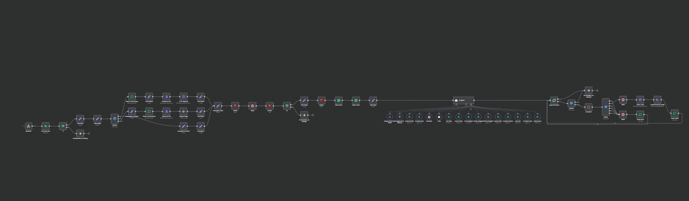

# autoamação_e_dashboard_agente_financeiro

# 💰 Agente Financeiro Automatizado no WhatsApp

Automação de atendimento financeiro via WhatsApp desenvolvida com n8n, integrada a banco de dados e um dashboard para visualização de dados em tempo real.

## 🧠 Visão Geral

Este projeto consiste em um agente automatizado capaz de interagir com usuários via WhatsApp para registrar, consultar e organizar informações financeiras.

A automação recebe mensagens, processa os dados, armazena em banco de dados e disponibiliza as informações em um dashboard para análise.

## ⚙️ Tecnologias Utilizadas 

- n8n (automação de workflows)
- API de WhatsApp
- Banco de dados (PostgreSQL / Supabase)
- Dashboard integrado ao Supabase

## 🔄 Como funciona

1. O usuário envia uma mensagem via WhatsApp  
2. A automação no n8n recebe via webhook  
3. Os dados são processados e tratados  
4. As informações são salvas no banco de dados (Supabase)  
5. O dashboard consome esses dados para visualização  
6. O usuário pode consultar seus dados via WhatsApp (agente de IA) ou pelo dashboard  

## 📌 Funcionalidades

- Registro de receitas e despesas  
- Consulta de saldo  
- Organização de dados financeiros  

### 🤖 Agente de IA (Mael)
- Interpretação de mensagens em linguagem natural  
- Suporte a texto, áudio e imagens  
- Registro automático de informações financeiras  
- Respostas contextualizadas com base no histórico do usuário  
- Análises financeiras básicas via conversa  

### 📊 Dashboard
- Visualização de dados financeiros em tempo real  
- Gráficos e análises de receitas e despesas  
- Acompanhamento de metas financeiras  
- Interface para consulta e organização dos dados  

### 📚 Documentação do Projeto

Este repositório está organizado em módulos, cada um com documentação detalhada.

Você pode explorar cada parte do sistema através dos READMEs específicos:

- 🤖 **Automação (n8n)**  
  Contém toda a lógica do agente de IA, processamento de mensagens e integrações  
  → Acesse a pasta da automação para ver o fluxo completo e explicações técnicas  

- 📊 **Dashboard**  
  Interface de visualização e análise dos dados financeiros  
  → Acesse a pasta do dashboard para ver as telas, funcionalidades e estrutura  

---

### 🧾 Detalhamento técnico

Cada módulo possui:

- Explicações detalhadas  
- Imagens do funcionamento  
- Estrutura técnica do projeto  
- **Código comentado**, explicando o que cada parte faz e como o sistema funciona internamente  

Isso facilita o entendimento do projeto tanto em nível visual quanto técnico.