# 📊 Dashboard Financeiro

Dashboard para visualização, análise e gestão de dados financeiros, integrado a um sistema de automação via WhatsApp.

---

## 🧠 Visão Geral

Este dashboard permite ao usuário acompanhar sua vida financeira de forma visual, organizada e em tempo real.

Os dados são registrados por meio de interações via WhatsApp (com suporte a IA) e armazenados em banco de dados, sendo posteriormente exibidos no dashboard por meio de gráficos, indicadores e histórico.

O sistema utiliza o número de telefone do WhatsApp como segundo identificador único do usuário além do login via email e senha, permitindo a associação entre as interações e os dados financeiros exibidos.

---

## ⚙️ Tecnologias Utilizadas

- Supabase (PostgreSQL)  
- Integração com automação (n8n)  
- Interface de dashboard para visualização de dados  

---

## 📊 Resumo Financeiro e Cadastro de Transações

🔐 Autenticação de Usuário

 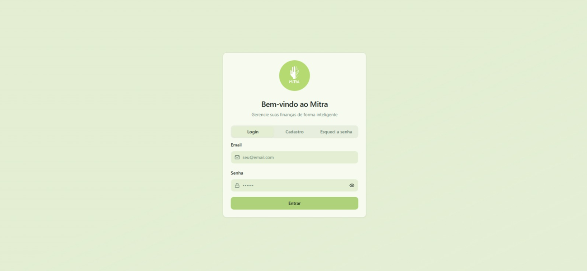

O sistema possui um fluxo completo de autenticação, garantindo acesso seguro aos dados financeiros de cada usuário.

### 📥 Acesso ao sistema

O usuário pode acessar a plataforma utilizando:

- E-mail  
- Senha  

---

### 🆕 Cadastro (Sign Up)

Caso ainda não possua uma conta, o usuário pode realizar o cadastro informando:

- E-mail  
- Senha  

Após o registro, o usuário já pode acessar o sistema e começar a utilizar as funcionalidades.

---

### 🔑 Login

Usuários já cadastrados podem realizar login normalmente utilizando suas credenciais.

O sistema autentica o usuário e carrega seus dados financeiros vinculados à conta.

---

### 🔁 Recuperação de senha

O sistema também possui funcionalidade de:

- “Esqueci minha senha”  

Permitindo ao usuário redefinir sua senha de forma segura.

---

### 🔗 Integração com WhatsApp

Após o login, o usuário pode cadastrar seu número de telefone na plataforma.

Esse número é vinculado à sua conta e utilizado para:

- Ativar a integração com a automação via WhatsApp  
- Permitir interação com o agente de IA  
- Associar as mensagens aos dados do usuário no sistema  

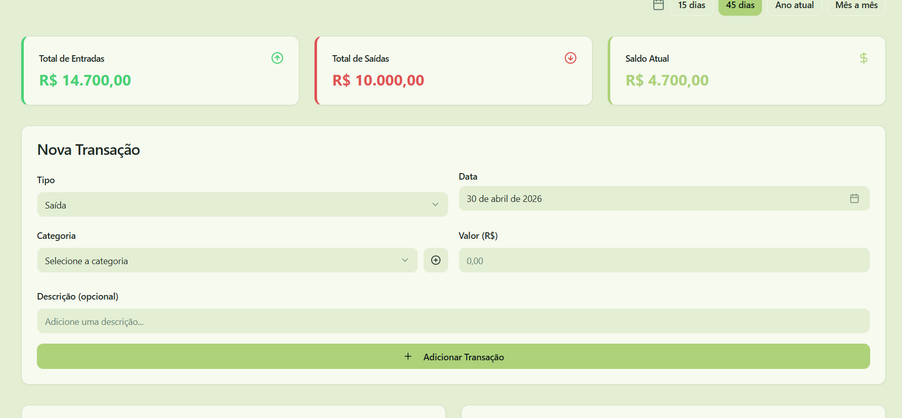

Nesta tela, o usuário pode:

- Visualizar:
  - Total de entradas  
  - Total de saídas  
  - Saldo atual (calculado automaticamente)  

- Registrar novas transações:
  - Tipo (entrada ou saída)  
  - Data  
  - Categoria (com possibilidade de criação)  
  - Valor  
  - Descrição  

O sistema realiza automaticamente o balanceamento do saldo com base nas transações registradas.

---

## 📈 Análise de Entradas e Saídas

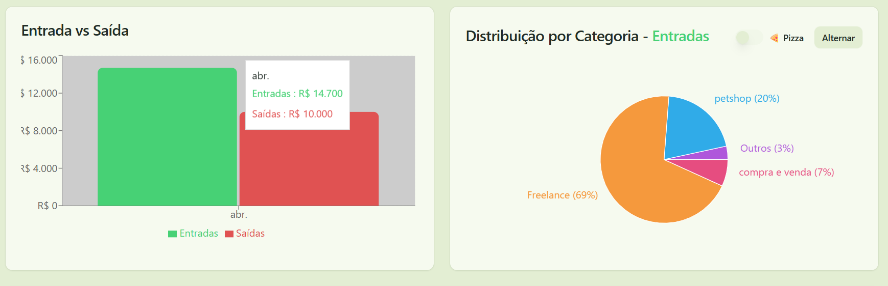

Gráfico que compara receitas e despesas ao longo do tempo, permitindo uma visão geral da situação financeira do usuário.

---

## 🥧 Distribuição por Categoria

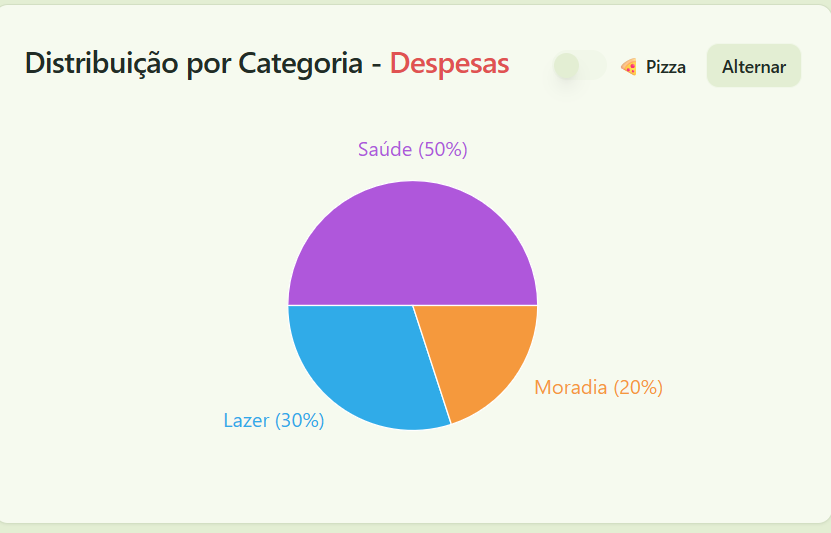
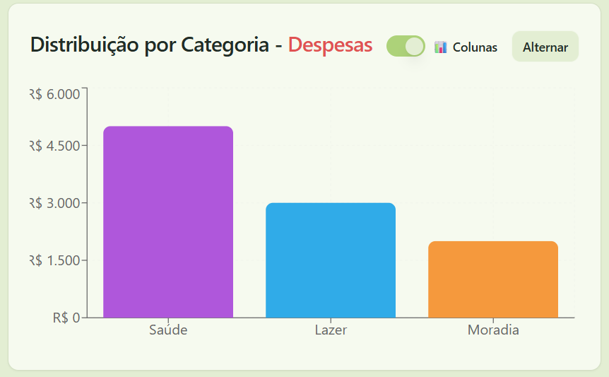

Permite visualizar como os valores estão distribuídos entre categorias.

Funcionalidades:
- Alternar entre:
  - Entradas  
  - Saídas  
- Alternar visualização:
  - Gráfico de pizza  
  - Tabela  

---

## 📉 Evolução do Saldo

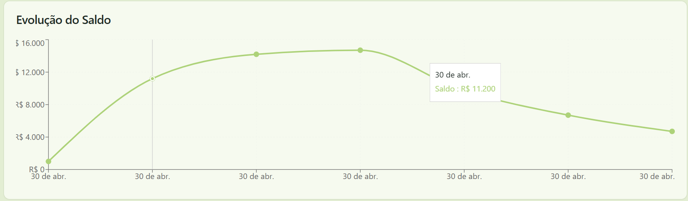

Gráfico que mostra a variação do saldo ao longo do tempo.

### ⏱️ Filtros de período:
- 15 dias  
- 30 dias  
- 6 meses  
- 1 ano  

Permite analisar tendências financeiras e identificar padrões de crescimento ou queda.

---

## 📜 Histórico de Transações

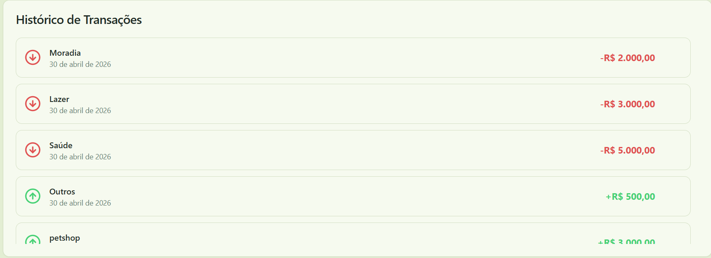

Lista completa das movimentações financeiras.

- Entradas exibidas em verde  
- Saídas exibidas em vermelho  
- Informações:
  - Categoria  
  - Data  
  - Valor  

Permite acompanhamento detalhado e cronológico das finanças.

---

## 🎯 Metas Financeiras

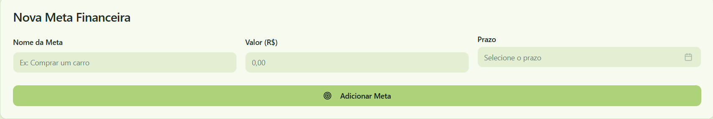

Permite ao usuário definir objetivos financeiros.

- Nome da meta  
- Valor  
- Prazo  

### 📊 Acompanhamento:
- Exibição do percentual (%) já atingido da meta  

Isso possibilita planejamento financeiro e acompanhamento de progresso.

---

### 🔄 Como funciona

1. O usuário acessa o dashboard e realiza login com e-mail e senha  
2. Após autenticado, o sistema utiliza o usuário logado como identificador principal  
3. O usuário cadastra seu número de telefone dentro da plataforma  
4. Esse número é vinculado à conta e passa a ser utilizado como identificador nas interações via WhatsApp  
5. A partir desse vínculo, o usuário pode interagir com a IA por meio de um número específico do sistema  
6. As mensagens são processadas pela automação e transformadas em dados estruturados  
7. As informações são armazenadas no banco de dados (Supabase)  
8. O dashboard consome esses dados com base no usuário autenticado e no número vinculado  
9. Os dados são exibidos em:
   - Indicadores  
   - Gráficos  
   - Histórico  
   - Metas  
---

## 📌 Funcionalidades

- Registro de receitas e despesas  
- Visualização de saldo em tempo real  
- Análise gráfica de dados financeiros  
- Distribuição por categoria  
- Filtros por período  
- Histórico completo de transações  
- Criação e acompanhamento de metas financeiras  

---

## 💡 Diferenciais

- Integração com automação via WhatsApp  
- Uso de IA para entrada de dados  
- Atualização em tempo real via banco de dados  
- Visualização dinâmica (gráficos e tabelas)  
- Análise temporal de dados financeiros  
- Planejamento financeiro com metas  

## visão geral:

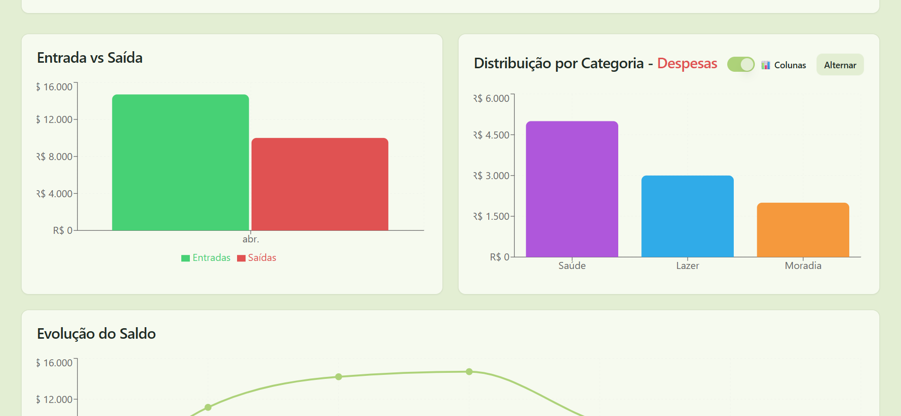
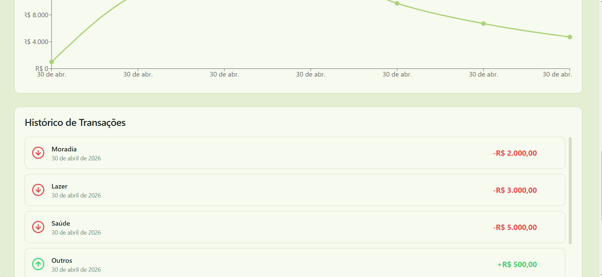
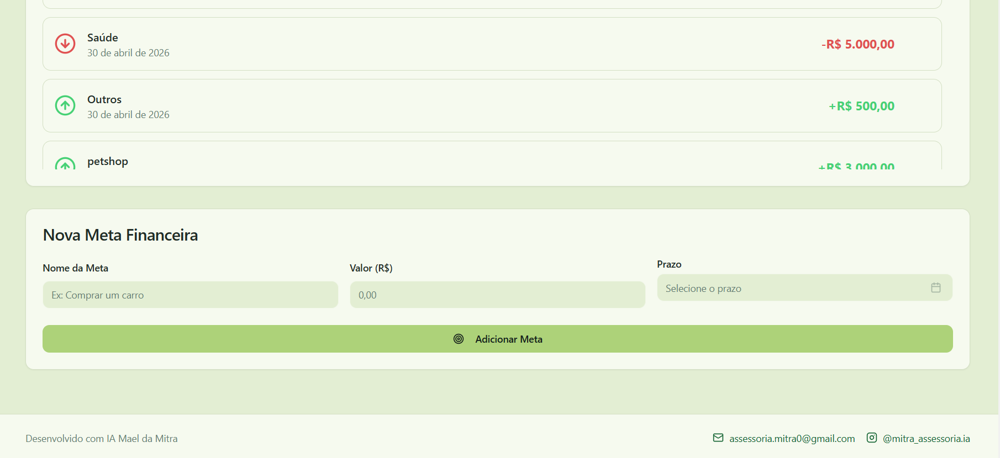
